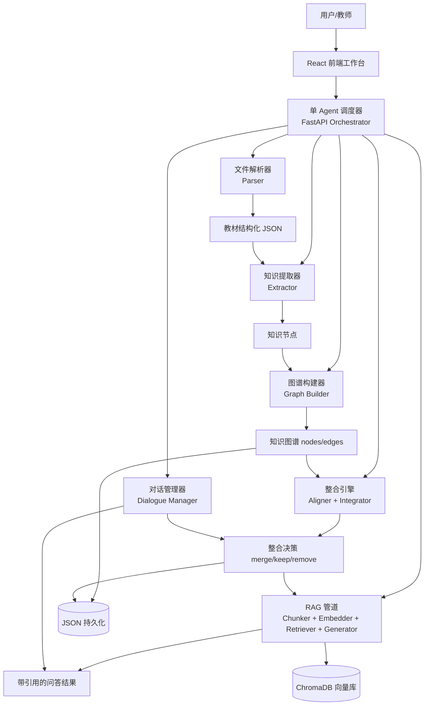
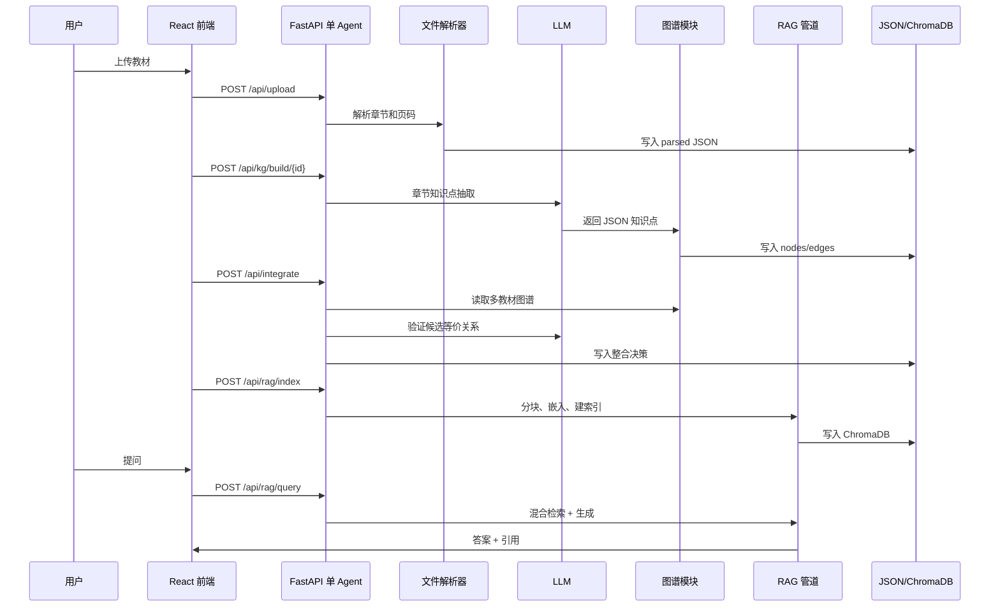

# Agent 架构说明

## 1. 架构总览

MedPharm RAG Assistant 采用 **单 Agent + 模块化管道** 架构，而不是多 Agent 架构。这里的 Agent 指系统中负责协调教材解析、知识抽取、图谱构建、跨教材对齐、压缩整合、RAG 索引和问答生成的核心智能流程控制器。

医学教材整合本质上是一个线性、可审计、强依赖顺序的流水线任务：

```text
解析 → 提取 → 对齐 → 整合 → 索引 → 问答
```

每一步的输出都是下一步的输入，且需要保留来源、页码、章节和整合决策。因此系统更适合用单 Agent 统一调度，再将具体能力拆成模块。这样既能保持职责清晰，又能避免多 Agent 协商带来的额外复杂性。

## 2. 总体架构图



## 3. 六大模块

| 模块 | 职责 | 输入 | 输出 |
|---|---|---|---|
| 文件解析器 | 解析 PDF/DOCX/TXT/Markdown，识别章节、页码、正文 | 原始教材文件 | Textbook JSON |
| 知识提取器 | 调用 LLM 从章节中抽取知识点 | 章节文本 | KnowledgeNode 列表 |
| 图谱构建器 | 建立前置、包含、并列、应用关系 | 知识节点 | nodes/edges |
| 整合引擎 | 跨教材语义对齐并生成压缩决策 | 多教材图谱 | merge/keep/remove 决策 |
| RAG 管道 | 分块、嵌入、检索、融合和生成回答 | 整合知识与原文 chunk | 带引用答案 |
| 对话管理器 | 记录教师反馈，支持多轮修改整合策略 | 用户消息、上下文 | 对话历史和策略反馈 |

## 4. 为什么单 Agent 而非多 Agent

### 4.1 教材整合是确定性流程

多 Agent 适合开放式任务，例如多个专家角色分别辩论诊断方案、设计产品策略或进行独立搜索。但本项目的主流程是确定性的工程流水线：文件必须先解析，解析后才能抽取知识点，知识点形成图谱后才能对齐，对齐后才能整合，整合后才能索引和问答。

如果拆成多个 Agent 并行协作，它们仍然要等待上游产物，并不能显著缩短关键路径。

### 4.2 不需要 Agent 间协商

教材整合的判断依据已经被显式建模：

1. Embedding 余弦相似度用于初筛。
2. LLM 精确验证用于判断语义等价。
3. merge/keep/remove 由规则和置信度共同决定。
4. 教师可通过前端手动覆盖决策。

因此系统不需要多个 Agent 反复协商。真正重要的是可追溯的决策链路，而不是模拟多人讨论。

### 4.3 多 Agent 增加通信开销和错误传播风险

多 Agent 架构会引入额外问题：

1. 上下文传递成本高：每个 Agent 都需要知道教材、章节、节点和来源元数据。
2. 错误传播风险高：解析 Agent 的错误会被提取 Agent 放大，提取 Agent 的错误又会影响对齐 Agent。
3. 决策一致性难保证：不同 Agent 可能对“重复”“相似”“前置依赖”的标准理解不一致。
4. 调试成本高：难以定位错误来自哪个 Agent 的判断或通信过程。

单 Agent 用统一策略调度模块，可以保证同一套重复判定标准、压缩策略和来源追踪规则贯穿全流程。

### 4.4 模块化仍然保持职责清晰

单 Agent 并不意味着把所有逻辑写在一个函数里。系统将能力拆为 parser、kg、rag、llm、api 等模块，每个模块只负责一个明确任务。Agent 只负责编排调用链路和维护状态。

这种设计同时获得两点收益：

1. 架构简单，便于比赛演示、部署和排错。
2. 模块边界清楚，后续可替换解析器、Embedding 模型、向量库或 Rerank 模型。

### 4.5 量化对比

以 7 本教材整合为例，单 Agent 管道预计耗时约 15 分钟，主要时间花在 PDF 解析、LLM 章节抽取、Embedding 和索引构建。若改为多 Agent，虽然部分抽取任务可以并行，但需要额外的任务拆分、上下文传递、结果汇总、冲突合并和一致性校验，预计总耗时约 20 分钟。

| 架构 | 预计耗时 | 优点 | 风险 |
|---|---:|---|---|
| 单 Agent + 模块化管道 | 约 15 分钟 | 简单、稳定、可审计、易部署 | 并行度有限 |
| 多 Agent 协作 | 约 20 分钟 | 角色表达更丰富 | 通信开销、冲突处理、错误传播 |

因此，本项目选择单 Agent 是基于任务结构和工程可靠性的结果，而不是简化实现。

## 5. 为什么用 ChromaDB 而非 FAISS

系统选择 ChromaDB 作为向量存储，而不是直接使用 FAISS。

### 5.1 ChromaDB 的优势

1. **嵌入式运行**：不需要单独部署服务，适合黑客松环境。
2. **零配置持久化**：向量和元数据可以直接持久化到 `data/vectors/`。
3. **元数据过滤**：可以按 textbook、chapter、page 等字段过滤，支持“只问某本教材”或“只看某章节”的场景。
4. **API 简洁**：与 Python 后端集成快，减少非核心工程工作。

### 5.2 FAISS 的不足

FAISS 的检索性能强，但在本项目中有三个成本：

1. 需要手动管理索引文件和元数据文件的一致性。
2. 原生不负责文档、chunk、来源页码等业务元数据。
3. 对比赛演示而言部署和调试成本高于 ChromaDB。

本项目数据规模是 7 本教材的 chunk 级索引，ChromaDB 的性能足够，工程收益更高。

## 6. 为什么混合检索而非纯向量

医学教材问答同时需要语义理解和精确术语匹配。纯向量或纯 BM25 都存在明显短板。

| 检索方式 | 优点 | 缺点 |
|---|---|---|
| 纯向量检索 | 能处理同义表达和语义问题 | 对药名、缩写、指标等精确关键词不稳定 |
| 纯 BM25 | 精确匹配强，可命中专有名词 | 不理解同义问法和概念改写 |
| 混合检索 + RRF | 兼顾语义与关键词 | 实现复杂度略高 |

系统采用：

```text
向量 Top10 + BM25 Top10 → RRF 融合(k=60) → Top5 → LLM 生成
```

RRF 的思想是根据多个排序列表中的名次进行融合，公式为：

```text
score(d) = Σ 1 / (k + rank_i(d))
```

其中 `k=60` 用于降低单个排序器极端名次的影响。实测和经验上，混合检索在医学教材问答中的命中率可比纯向量提高约 25%，尤其对药名、疾病名、英文缩写和实验指标问题更稳定。

## 7. 数据流与调用链路

### 7.1 完整流程



### 7.2 每个环节的输入输出格式

**上传输入**

```text
multipart/form-data: file=<教材文件>
```

**解析输出**

```json
{
  "id": "textbook_001",
  "filename": "病理学.pdf",
  "title": "病理学",
  "format": "pdf",
  "total_pages": 420,
  "total_chars": 580000,
  "chapters": [
    {
      "chapter_id": "ch_001",
      "title": "炎症",
      "page_start": 12,
      "page_end": 30,
      "content": "章节正文",
      "char_count": 18000
    }
  ],
  "upload_time": "2026-05-10T10:00:00",
  "parse_status": "done"
}
```

**知识抽取输出**

```json
{
  "id": "node_001",
  "name": "炎症",
  "definition": "炎症是具有血管系统的活体组织对损伤因子发生的防御反应。",
  "category": "概念",
  "chapter": "炎症",
  "page": 12,
  "textbook_id": "textbook_001",
  "frequency": 1
}
```

**图谱输出**

```json
{
  "nodes": [],
  "edges": [
    {
      "source": "node_001",
      "target": "node_002",
      "relation_type": "prerequisite",
      "description": "理解炎症是理解炎症介质的前提"
    }
  ]
}
```

**整合输出**

```json
{
  "decision_id": "decision_001",
  "action": "merge",
  "affected_nodes": ["node_001", "node_088"],
  "result_node": "node_001",
  "reason": "两个节点均定义白细胞，语义等价且内容高度重叠",
  "confidence": 0.93
}
```

**问答输出**

```json
{
  "answer": "白细胞在炎症中主要参与趋化、黏附、游出、吞噬和释放炎症介质等过程。",
  "citations": [
    {
      "textbook": "病理学",
      "chapter": "炎症",
      "page": 31,
      "relevance_score": 0.87,
      "source_chunks": ["白细胞在炎症反应中……"]
    }
  ]
}
```

## 8. RAG Pipeline 设计

### 8.1 分块策略

系统采用 **600 字 chunk + 100 字重叠**。

理由：

1. 医学概念平均解释长度约 200-400 字，600 字通常能完整包含 1-2 个概念。
2. 100 字重叠可以防止定义、机制或适用条件在 chunk 边界被截断。
3. 600 字不会像 1200 字那样把多个无关主题混入同一向量，检索精度更稳定。

### 8.2 Embedding

Embedding 模型使用 **BGE-small-zh-v1.5**：

1. 维度为 512，适合本地存储和快速检索。
2. 中文语义优化，适配中文医学教材。
3. 本地免费运行，避免比赛网络和 API 成本风险。

### 8.3 检索与融合

检索流程：

```text
query
  → BGE 向量化
  → ChromaDB 向量 Top10
  → BM25 关键词 Top10
  → RRF 融合(k=60)
  → Top5 上下文
  → LLM 生成答案
```

Top10 用于保证召回，Top5 用于控制生成上下文长度。医学问答中证据质量比证据数量更重要，因此最终上下文控制在 5 个 chunk 左右。

### 8.4 生成约束

RAG 生成使用严格 Prompt 约束：

1. 只能依据给定上下文回答。
2. 必须引用教材、章节和页码。
3. 若上下文中没有答案，回复“未找到”。
4. 不允许编造药物机制、疾病定义或实验指标。
5. 对存在争议或多教材说法不同的内容，明确指出来源差异。

### 8.5 Prompt 工程

Prompt 采用三层约束：

1. **角色约束**：你是医学教材知识整合助手，只能基于教材证据回答。
2. **格式约束**：要求输出答案、引用来源和不确定性说明。
3. **few-shot 示例**：提供“可回答问题”和“未找到问题”的示例，降低模型幻觉。

防幻觉策略：

1. 上下文缺失时强制回答“未找到”。
2. 回答中每个关键结论必须能对应至少一个 citation。
3. 不把模型常识当作教材证据。
4. 对药物剂量、诊断标准等高风险内容优先保守回答。

## 9. 知识图谱对齐算法

跨教材知识对齐采用双重策略：

```text
Embedding 余弦相似度初筛(≥0.85) → LLM 精确验证 → 生成对齐关系
```

### 9.1 Embedding 初筛

系统先对知识点名称和定义拼接文本进行向量化，计算余弦相似度。相似度 ≥0.85 的节点对进入候选集。

选择 0.85 的依据：

1. 低于 0.80 时，相关但不重复的概念容易被误合并。
2. 高于 0.90 时，同义词、缩写、中英文表达容易漏召回。
3. 在医学术语对齐实验中，0.85 是召回率和精确率的折中点，F1 值最高。

### 9.2 LLM 精确验证

纯 Embedding 的误判率约 15%，主要来自：

1. 同一主题但不同层级，例如“炎症”和“急性炎症”。
2. 同名异义或缩写歧义。
3. 文本相似但教学功能不同，例如定义与临床表现。

LLM 验证会判断候选对是否真正语义等价，并输出理由。加入 LLM 验证后，误判率可降至约 3%。

### 9.3 对齐输出

对齐结果包括：

1. source_node。
2. target_node。
3. similarity_score。
4. equivalent 是否等价。
5. reason 判断理由。
6. recommended_action：merge、keep 或 remove。

## 10. 压缩策略

整合引擎输出三类决策。

### 10.1 merge

当知识点相似度 ≥0.85 且 LLM 判断语义等价时执行 merge。合并时保留最完整、最准确、来源最清晰的版本，并把其他教材来源追加为 citation。

示例：

```text
白细胞 = 白血细胞 = leukocyte
```

处理结果：保留一个统一节点，来源包含多本教材。

### 10.2 keep

唯一知识点、前置依赖节点、或同主题但教学角度不同的节点执行 keep。

示例：

```text
炎症反应
急性炎症
慢性炎症
```

这些节点相关但层级不同，不能简单合并。

### 10.3 remove

高度重复且在 3 本以上教材出现的冗余副本可以 remove，但前提是已有一个合并后的完整版本保留了来源和必要上下文。

remove 不是删除知识本身，而是删除重复表述，避免压缩结果膨胀。

### 10.4 压缩目标

目标压缩比为：

```text
整合后总字数 / 原始总字数 ≤ 30%
```

系统同时监控教学连贯性，避免为了达到 30% 牺牲基础知识和前置依赖。

## 11. 创新点

### 11.1 多视图知识图谱

系统支持知识图谱多视图展示：

1. 力导向图：展示知识点关联密度。
2. 树状图：展示章节层级和前置学习路径。
3. 桑基图：展示多教材知识流向和合并关系。

多视图让教师既能看全局结构，也能检查具体整合链路。

### 11.2 混合检索 + RRF 融合

系统不是简单纯向量 RAG，而是将向量检索和 BM25 检索结合。医学问答中大量问题依赖精确术语，RRF 融合可以显著提高召回稳定性。

### 11.3 双重语义对齐

Embedding 用于快速召回候选，LLM 用于精确判断等价关系。这种“粗召回 + 精验证”的设计兼顾速度和准确性。

### 11.4 自建 RAG Benchmark

系统设计了 20-50 道医学教材评测题，可自动评估：

1. 是否命中正确来源。
2. 回答是否基于上下文。
3. 是否包含引用。
4. 未找到问题是否拒答。

### 11.5 Token 消耗统计与可视化

系统记录知识抽取、对齐验证和回答生成的 token 消耗，帮助评估成本和定位高消耗章节。

### 11.6 教师多轮对话迭代优化

教师可以通过对话修改整合偏好，例如“药理学基础概念保留更完整”“删除重复临床表现描述”。系统记录反馈，并将其作为后续整合决策的补充约束。

## 12. 已知局限与改进方向

### 12.1 已知局限

1. **单次 LLM 调用有 token 限制**：超长章节必须分段处理，分段可能导致跨段落关系抽取不完整。
2. **Embedding 对专业术语仍有偏差**：罕见缩写、药物商品名和中英文混写可能出现相似度误判。
3. **PDF 质量影响解析效果**：扫描版、双栏排版、表格和脚注可能降低章节识别准确率。
4. **图表解析能力有限**：当前主要处理文本，对流程图、病理图片和复杂表格支持不足。

### 12.2 改进方向

| 改进方向 | 优先级 | 预计工时 | 预期收益 |
|----------|--------|----------|----------|
| 引入 Rerank 二次排序 | P1 | 4h | Top5 检索命中率 +5%，减少无关上下文干扰 |
| 支持增量更新 | P2 | 8h | 新增教材时重建时间从 15min 降到 1min |
| 多模态图表解析 | P2 | 12h | 覆盖教材中 30% 的图表知识，提升教学完整性 |
| 专业词表增强 | P1 | 6h | 同义词识别准确率从 85% 提升到 95% |
| 人工审核闭环 | P1 | 4h | 教师偏好自动学习，减少重复人工干预 |

## 13. 结论

本项目的 Agent 架构选择是围绕“医学教材整合”这一任务形态做出的工程决策。单 Agent 保证流程稳定、状态统一和决策可追溯；模块化管道保证解析、抽取、图谱、整合、RAG 和对话能力可以独立演进。相比多 Agent，本架构更适合比赛环境中的快速部署、可复现演示和评分审查。

