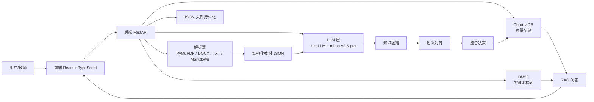
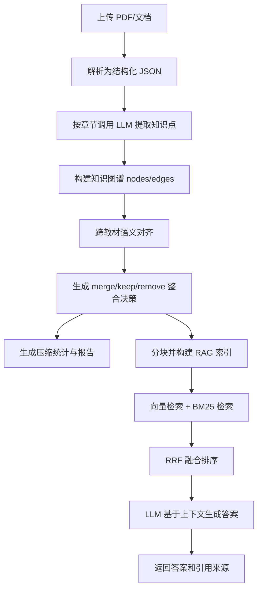

# 系统设计

## 1. 系统概述

MedPharm RAG Assistant 采用前后端分离架构。前端负责教材上传、知识图谱展示、整合决策查看、RAG 问答和多轮对话；后端负责文件解析、LLM 知识抽取、知识图谱构建、跨教材语义对齐、压缩决策、向量索引和答案生成。数据以 JSON 文件和 ChromaDB 本地持久化为主，避免比赛环境中引入复杂数据库依赖。

## 2. 系统架构图



## 3. 数据流

完整数据流如下：



关键中间数据：

1. **教材 JSON**：教材 ID、文件名、格式、页数、总字数、章节列表。
2. **知识图谱 JSON**：知识节点、关系边、章节和页码来源。
3. **整合决策 JSON**：merge、keep、remove 决策及置信度。
4. **RAG 索引**：chunk 文本、embedding、教材/章节/页码元数据。
5. **对话历史 JSON**：conversation_id、user/assistant 消息和时间戳。

## 4. 技术选型及理由

### 4.1 Web 层：FastAPI

选择 FastAPI 的原因：

1. 原生异步能力适合文件上传、LLM 调用和索引构建等 I/O 密集任务。
2. 基于 Pydantic 的类型校验可以约束请求和响应格式。
3. 自动生成 OpenAPI 文档，便于评委通过 `/docs` 直接验证接口。
4. 与 Python 生态中的 PyMuPDF、sentence-transformers、ChromaDB 集成成本低。

### 4.2 解析层：PyMuPDF

PDF 解析采用 PyMuPDF，理由是：

1. 解析速度快，适合多本教材批量处理。
2. 支持逐页解析，避免一次性加载超大 PDF。
3. 可读取字体、字号、文本块位置，用于章节标题识别和页眉页脚过滤。
4. 对中文 PDF 的文本抽取稳定性较好。

### 4.3 LLM 层：mimo-v2.5-pro via LiteLLM

LLM 通过 LiteLLM 代理调用 mimo-v2.5-pro：

1. mimo-v2.5-pro 中文理解和结构化输出能力较强，适合医学教材知识抽取。
2. LiteLLM 提供统一 OpenAI 兼容接口，后续可低成本切换模型。
3. 通过 `.env` 配置密钥、模型和 base URL，避免硬编码。
4. 性价比优于直接使用高价闭源模型，适合竞赛迭代。

### 4.4 向量层：ChromaDB

选择 ChromaDB 的原因：

1. 嵌入式运行，零配置，不需要额外服务。
2. 自带持久化，比赛演示环境部署简单。
3. 支持元数据过滤，可按教材、章节、页码筛选。
4. Python API 简洁，适合快速构建 RAG 原型。

### 4.5 检索层：混合检索

系统采用“向量检索 + BM25 + RRF 融合”的混合检索：

1. 向量检索擅长语义匹配，例如“抗炎药作用机制”召回“抑制前列腺素合成”。
2. BM25 擅长精确关键词匹配，例如药名、缩写、术语和指标。
3. RRF 融合能降低单一检索器偏差，使语义召回和关键词召回互补。

### 4.6 前端：React + ECharts

选择 React + ECharts 的原因：

1. React 生态成熟，适合构建单页工作台。
2. TypeScript 类型系统能与后端 Pydantic 模型对应，减少接口误用。
3. ECharts 支持 graph、tree、sankey、heatmap 等多种知识图谱视图。
4. 前端可以快速实现上传、图谱浏览、决策覆盖、RAG 问答和报告展示。

## 5. API 接口一览

本地后端默认地址为 `http://localhost:8100`，OpenAPI 文档为 `http://localhost:8100/docs`。

### 5.1 基础信息

**GET /**

响应示例：

```json
{
  "name": "MedPharm RAG Assistant API",
  "version": "0.1.0",
  "status": "running",
  "docs": "/docs",
  "features": ["textbook parsing", "knowledge graph", "integration", "rag", "dialogue"]
}
```

### 5.2 文件上传与教材管理

**POST /api/upload**

请求：`multipart/form-data`

| 字段 | 类型 | 说明 |
|---|---|---|
| file | File | PDF、DOCX、TXT 或 Markdown 教材 |

响应示例：

```json
{
  "id": "textbook_001",
  "filename": "病理学.pdf",
  "title": "病理学",
  "format": "pdf",
  "total_pages": 420,
  "total_chars": 580000,
  "chapters": [],
  "upload_time": "2026-05-10T10:00:00",
  "parse_status": "done"
}
```

**GET /api/textbooks**

响应：教材列表。

**GET /api/textbooks/{textbook_id}/chapters**

响应示例：

```json
{
  "textbook_id": "textbook_001",
  "chapters": [
    {
      "chapter_id": "ch_001",
      "title": "炎症",
      "page_start": 12,
      "page_end": 30,
      "content": "……",
      "char_count": 18000
    }
  ]
}
```

**DELETE /api/textbooks/{textbook_id}**

响应示例：

```json
{
  "deleted": true,
  "textbook_id": "textbook_001"
}
```

### 5.3 知识图谱

**POST /api/kg/build/{textbook_id}**

说明：为单本教材构建知识图谱。

响应示例：

```json
{
  "nodes": [
    {
      "id": "node_001",
      "name": "白细胞",
      "definition": "白细胞是参与机体免疫防御的一类血细胞。",
      "category": "概念",
      "chapter": "血液",
      "page": 25,
      "textbook_id": "textbook_001",
      "frequency": 3
    }
  ],
  "edges": [
    {
      "source": "node_001",
      "target": "node_002",
      "relation_type": "prerequisite",
      "description": "理解白细胞分类是理解炎症细胞浸润的前提"
    }
  ]
}
```

**GET /api/kg/{textbook_id}**

说明：获取单本教材图谱。

**GET /api/kg/all**

说明：获取所有教材合并图谱。

### 5.4 跨教材整合

**POST /api/integrate**

说明：执行跨教材语义对齐和整合决策。

响应示例：

```json
{
  "matched_pairs": [
    { "source": "node_001", "target": "node_088", "score": 0.91 }
  ],
  "decisions": [
    {
      "decision_id": "decision_001",
      "action": "merge",
      "affected_nodes": ["node_001", "node_088"],
      "result_node": "node_001",
      "reason": "白细胞与 leukocyte 语义等价，定义高度重叠",
      "confidence": 0.93
    }
  ],
  "compression_ratio": 0.28
}
```

**GET /api/integrate/decisions**

说明：获取整合决策列表。

**POST /api/integrate/override**

请求示例：

```json
{
  "decision_id": "decision_001",
  "action": "keep",
  "reason": "教师认为两个教材的临床侧重点不同"
}
```

响应：更新后的整合决策。

**GET /api/integrate/stats**

响应示例：

```json
{
  "original_chars": 3500000,
  "compressed_chars": 980000,
  "compression_ratio": 0.28,
  "merge_count": 420,
  "keep_count": 730,
  "remove_count": 860
}
```

### 5.5 RAG 问答

**POST /api/rag/index**

说明：对整合后的教材内容构建 RAG 索引。

响应示例：

```json
{
  "indexed_textbooks": 7,
  "total_chunks": 5200,
  "updated_at": "2026-05-10T10:30:00"
}
```

**POST /api/rag/query**

请求示例：

```json
{
  "query": "白细胞在炎症反应中的作用是什么？"
}
```

响应示例：

```json
{
  "answer": "白细胞通过趋化、黏附、游出和吞噬等过程参与炎症反应……",
  "citations": [
    {
      "textbook": "病理学",
      "chapter": "炎症",
      "page": 31,
      "relevance_score": 0.87,
      "source_chunks": ["白细胞在炎症局部聚集……"]
    }
  ]
}
```

**GET /api/rag/status**

响应示例：

```json
{
  "indexed_textbooks": 7,
  "total_chunks": 5200,
  "ready": true,
  "updated_at": "2026-05-10T10:30:00"
}
```

### 5.6 多轮对话

**POST /api/dialogue/chat**

请求示例：

```json
{
  "message": "请把药理学中重复出现的药代动力学基础概念保留得更完整。",
  "conversation_id": "conv_001"
}
```

响应示例：

```json
{
  "conversation_id": "conv_001",
  "message": "已记录你的偏好，后续整合将提高药代动力学基础概念的保留权重。",
  "timestamp": "2026-05-10T10:35:00"
}
```

**GET /api/dialogue/history?conversation_id=conv_001**

响应：对话历史消息列表。

### 5.7 报告

**GET /api/report**

说明：获取整合报告数据，包括原始统计、压缩统计、决策分布、图谱统计和典型整合案例。

## 6. 存储设计

系统采用 JSON 文件持久化和 ChromaDB 向量持久化。

### 6.1 为什么使用 JSON 文件

1. **轻量**：比赛环境部署简单，不需要安装和维护数据库。
2. **可读**：评委和开发者可以直接查看解析结果、图谱和整合决策。
3. **可复现**：同一输入文件对应明确的中间产物，便于调试。
4. **易迁移**：后续可平滑迁移到 SQLite、PostgreSQL 或图数据库。

### 6.2 数据目录

```text
data/
├── textbooks/   # 上传的教材文件
├── parsed/      # 解析后的教材 JSON
├── kg/          # 知识图谱 nodes/edges
├── vectors/     # ChromaDB 向量索引
├── decisions/   # 整合决策
└── dialogue/    # 多轮对话历史
```

### 6.3 数据一致性原则

1. 教材 ID 是所有数据的主键前缀，避免不同教材冲突。
2. 节点 ID 在知识图谱、整合决策和引用来源中保持一致。
3. RAG chunk 保留 textbook、chapter、page 等元数据，确保回答可追溯。
4. 用户覆盖决策不会删除原始决策，而是写入新的覆盖原因，便于审计。

