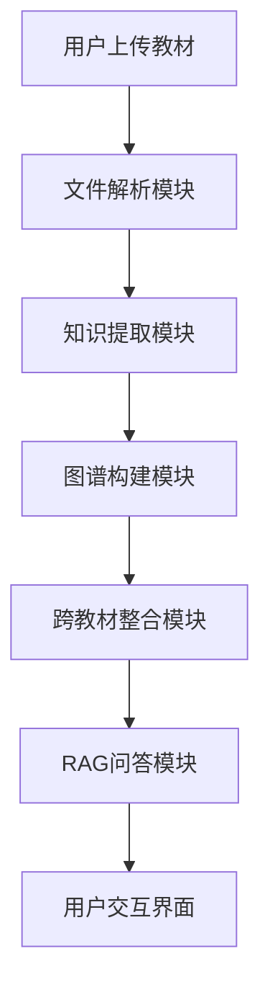

# 全栈极速黑客松·赛题文档

## 学科知识整合智能体开发

开发一个AI智能体，对多本教材进行知识整合：构建可视化知识图谱 | 跨教材去重提纯 | RAG精准问答 | 自主设计Agent架构

**比赛时长：5小时**

## 1 赛题背景

在当前高校教学体系中，同一学科领域往往存在多本教材并行使用的现象。这些教材由不同出版社出版、不同作者编写，虽然各有侧重，但彼此之间存在大量的内容重复。以计算机科学为例，“数据结构与算法”这门课可能有七八本主流教材，其中关于“排序算法”的章节在每本书中都会出现，讲解内容高度雷同，但表述方式和组织逻辑各不相同。

这种冗余对学生、教师和教学管理者都带来了实际困扰：学生大量时间浪费在重复阅读上，教师难以系统评估教材间的交叉与缺失，教学管理者缺乏数据驱动的课程整合依据。

**你的任务：** 用AI帮教师把7本教材变成不到2.1本的精华，而且变完之后教学效果不打折。

## 2 任务目标

开发一个学科知识整合智能体，它能够：

1. 自动加载多本教材（多格式支持）
2. 为每本教材构建知识图谱并可优化
3. 跨教材识别知识点的重叠、互补与缺失
4. 将多本教材的内容整合压缩到不超过原始体量 30% 的精华版本
5. 基于整合后的知识库进行RAG精准问答（必须引用原文来源）
6. 自主设计Agent架构并提交架构说明文档
7. 通过与学科教师的多轮对话，迭代优化整合方案

## 3 功能要求

### 3.1 必须实现的功能（P0）

#### （1）多格式教材加载与解析

系统需要支持加载多种格式的教材文件，解析后统一转化为结构化数据。具体要求：

- 支持的格式：PDF（必须）、Markdown（必须）、TXT（必须）、Word.docx（建议）、Excel（可选）
- 前端提供文件上传区域，支持拖拽上传和点击选择，支持批量上传多个文件
- 上传后显示文件列表，包含：文件名、格式、大小、解析状态（解析中/已完成/失败）
- 解析后的统一输出结构：

```json
{
  "textbook_id": "book_01",
  "filename": "生理学.pdf",
  "title": "生理学",
  "total_pages": 520,
  "total_chars": 385000,
  "chapters": [
    {
      "chapter_id": "ch_01",
      "title": "第一章 绪论",
      "page_start": 1,
      "page_end": 15,
      "content": "生理学是研究生物体正常生命活动规律的科学...",
      "char_count": 8500
    }
  ]
}
```

- PDF解析需要处理的问题：章节标题识别（通过字体大小、加粗或正则匹配”第X章”）、页眉页脚过滤、图表区域跳过
- 大文件处理：逐页解析，不要一次性把整本书加载到内存。

**验收标准：** 上传一本PDF教材后，系统能正确识别出章节结构并显示在前端。

#### （2）单本教材知识图谱构建与可视化

为每本教材分别构建知识图谱并以可视化形式展示。具体要求：

- 对每个章节调用LLM，提取该章节中的核心知识点（概念、定理、方法、现象等）
- 每个知识点需要结构化输出：

```json
{
  "id": "node_001",
  "name": "动作电位",
  "definition": "细胞受到刺激后，膜电位发生的一次快速而可逆的倒转...",
  "category": "核心概念",
  "chapter": "第二章 细胞的基本功能",
  "page": 35
}
```

- 识别知识点之间的关系，关系类型至少包含以下四种中的三种：

| 关系类型 | 说明 | 示例 |
| --- | --- | --- |
| 前置依赖（prerequisite） | 学习B之前必须先掌握A | “动作电位”依赖”静息电位” |
| 并列关系（parallel） | 同一层级的平行概念 | “有丝分裂”与“减数分裂” |
| 包含关系（contains） | 上位概念与下位概念 | “免疫系统”包含“T细胞” |
| 应用关系（applies_to） | 某知识点是另一个的应用场景 | “抗体”应用于“体液免疫” |

- 关系的输出结构：

```json
{
  "source": "node_001",
  "target": "node_002",
  "relation_type": "prerequisite",
  "description": "理解动作电位需要先掌握静息电位的概念"
}
```

- LLM调用时的Prompt设计建议：明确要求输出JSON格式，给出few-shot示例，限制每次调用只处理一个章节（避免上下文过长）

**验收标准：** 选择一本教材后，系统能生成该教材的知识图谱数据（JSON格式的节点和边列表），并在前端以可视化形式展示。

#### （3）知识图谱可视化交互

知识图谱需要支持用户交互操作，不能只是一张静态图片。具体要求：

- **节点点击：** 点击任意节点，弹出或侧边展示该知识点的详细信息（名称、定义、所在章节、原文出处）
- **频次可视化：** 当加载多本教材后，节点大小或颜色深度应反映该知识点在多本教材中出现的频次（出现次数越多 → 节点越大或颜色越深）
- **教材来源区分：** 不同教材来源的知识点用不同颜色标识
- **基本交互：** 支持鼠标滚轮缩放、拖拽移动画布、拖拽移动单个节点
- **搜索（建议实现）：** 输入关键词搜索知识点，高亮匹配的节点

推荐技术方案：D3.js 力导向图、ECharts 关系图、Cytoscape.js、AntV G6。选一个即可。

**验收标准：** 知识图谱能在浏览器中渲染，点击节点能看到详细信息，能通过视觉元素区分不同教材和频次。

#### （4）跨教材知识图谱整合（核心难点）

将多本教材的知识图谱合并，去重提纯，这是本赛题最核心的技术挑战。具体要求：

- **语义对齐：** 识别不同教材中描述同一概念的知识点，即使措辞不同。例如“白细胞”和“白血细胞”和“leukocyte”应该被识别为同一知识点
- 对齐算法至少包含一种：
  - 文本嵌入（Embedding）计算语义相似度，设定阈值判断是否为同一知识点
  - LLM判断两个知识点是否等价（更准确但更贵）
  - 两种结合（推荐）
- **整合决策：** 对于被识别为重复的知识点，系统需要做出决策：

```json
{
  "decision_id": "merge_001",
  "action": "merge",
  "affected_nodes": ["book01_node_015", "book03_node_032", "book05_node_008"],
  "result_node": "merged_node_001",
  "reason": "三本教材都讲解了炎症的概念，保留《病理学》的版本因其描述最系统完整",
  "confidence": 0.92
}
```

- 决策类型包括：merge（合并重复）、keep（保留唯一）、remove（删除冗余）
- **压缩比控制：** 整合后保留的内容总字数不超过原始总字数的 30%。系统需要在前端展示压缩比统计（原始总字数 → 整合后字数 → 压缩比百分比）
- **可视化对比（建议实现）：** 展示整合前后的知识图谱对比，让用户直观看到哪些节点被合并、哪些被删除

**验收标准：** 加载2本以上教材后，系统能自动识别重复知识点，执行整合，输出整合决策列表，压缩比不超过 30%

#### （5）RAG精准问答

系统必须实现基于教材内容的RAG（Retrieval-Augmented Generation）问答功能。这不是普通的聊天机器人，而是要求每一个回答都有据可查。

**完整RAG Pipeline要求：**

**第一步·文档分块（Chunking）：**
- 将每本教材的正文拆分为小块（chunk），每块约500-800字
- 相邻块之间有50-100字的重叠（sliding window），防止知识点被截断
- 每个chunk必须保留元数据：教材名称、章节标题、起始页码
- 在文档中说明你选择这个分块粒度的理由

**第二步·向量嵌入（Embedding）：**
- 将每个chunk转化为向量表示
- 推荐使用：sentence-transformers（本地运行，免费）或OpenAI Embedding API
- 如果使用中文教材，建议选择支持中文的模型（如 paraphrase-multilingual-MiniLM-L12-v2 或 BGE-small-zh）

**第三步·向量存储与检索：**
- 将所有chunk的向量存入向量数据库（推荐 FAISS 或 ChromaDB，轻量级）
- 用户提问时，将问题转为向量，检索 top-5 最相关的chunk
- **（加分）** 可选实现混合检索：向量检索 + BM25 关键词检索，取并集后重排序

**第四步·生成回答：**
- 将检索到的 top-5 chunk 作为上下文注入 LLM prompt
- Prompt 必须包含以下约束：
  - 只基于提供的上下文回答，不使用自身知识
  - 每个回答附带来源引用，格式为 [教材名称, 第X章, 第X页]
  - 如果上下文中找不到答案，回复“当前知识库中未找到相关信息”

**前端界面要求：**
- 提供问答输入框，用户输入问题后获得回答
- 回答区域展示：回答正文 + 引用来源列表
- 每条引用显示：教材名、章节、页码、相关度分数
- 点击引用可展开查看原文chunk内容
- 界面上方显示索引状态（已索引X本教材，共X个知识块）

**API接口设计参考：**
- POST /api/rag/index → 对已上传教材建立向量索引
- POST /api/rag/query → 输入问题，返回带引用的回答
- GET /api/rag/status → 查询索引状态

返回数据结构示例：

```json
{
  "answer": "炎症是机体对致炎因子的损伤所发生的防御性反应...",
  "citations": [
    {
      "textbook": "病理学",
      "chapter": "第四章 炎症",
      "page": 78,
      "relevance_score": 0.92,
      "source_chunks": [
        "炎症(inflammation)是具有血管系统的活体组织对各种损伤因子的刺激...",
        "机体免疫系统在炎症反应中发挥重要作用..."
      ]
    },
    {
      "textbook": "生理学",
      "chapter": "第九章 免疫",
      "page": 302,
      "relevance_score": 0.85,
      "source_chunks": [...]
    }
  ]
}
```

**验收标准：** 上传教材 → 建立索引 → 输入问题 → 获得带引用来源的回答，引用的教材和章节与问题内容相关。

**鼓励自建RAG Benchmark：**

我们强烈鼓励选手在开发过程中自行构建更完整的RAG评测集，用数据驱动的方式优化你的RAG pipeline。这本身就是AI工程能力的重要体现。

你可以做的事情包括但不限于：
- 自己利用AI编写20-50个测试问题，覆盖不同难度和类型（事实性/比较性/推理性/跨教材）
- 为每个问题标注预期答案和预期引用来源（ground truth）
- 跑自动化评测，统计回答准确率、引用准确率、平均响应时间、Token消耗
- 对比不同分块策略（300字 vs 500字 vs 800字）、不同embedding模型、有无rerank的效果差异
- 将评测结果整理成表格或图表，写入 `docs/Agent架构说明.md` 或P2技术报告中

有benchmark数据支撑的RAG设计，在架构评分维度（25分）中会获得显著更高的评分，并且会在P2技术报告中拿到更高的分。

#### （6）Agent架构设计与说明文档

选手需要自主设计系统的Agent架构，并提交一份 `docs/Agent架构说明.md` 文档。这不是一道有标准答案的题目。你可以用单Agent跑通所有功能，也可以设计多Agent协作系统——关键是你的设计决策必须有充分的理由。

架构说明文档必须包含以下内容：

**a）架构总览**
- 你的系统有几个Agent（或模块）？各自负责什么？
- 用一段话或一张图说清楚整体架构
- 建议使用Mermaid语法画架构图，例如：



**b）设计决策论证**
- 为什么选择这种架构？解决了什么问题？
- 如果是单Agent：为什么不拆分？你如何管理prompt的复杂度和上下文长度？
- 如果是多Agent：为什么要拆？每个Agent的职责边界如何划定？Agent之间如何通信和协调？

**c）数据流与调用链路**
- 一次完整的”上传教材 → 构建图谱 → 整合 → 问答”流程中，数据如何在各模块/Agent之间流转？
- 关键接口的输入输出是什么？

**d）取舍与权衡**
- 你在设计过程中放弃了哪些方案？为什么？
- 你的架构有什么已知局限？如果给你更多时间你会怎么改进？

评分不看Agent数量，看设计决策的合理性和论证深度。一个论证充分的单Agent方案可以比一个没想清楚就硬拆的三Agent方案得分更高。

#### （7）整合建议与多轮对话

系统需要对整合决策提供解释，并支持教师通过对话修改整合方案。

具体要求：
- 系统对每一项整合决策给出理由（为什么合并这几个知识点、为什么删除这个知识点）
- 提供聊天界面，教师可以用自然语言跟系统对话，例如：
  - ”为什么把《生理学》里的‘炎症’和《病理学》里的‘炎症反应’合并了？”
  - ”我觉得‘免疫应答’不应该被删除，请保留”
  - ”把‘抗原’和‘免疫原’分开，它们不是同一个概念”
- 系统根据教师反馈调整整合结果，并在知识图谱中实时更新
- 对话历史需要持久化（至少在同一个会话中保留上下文）

**验收标准：** 教师能通过对话修改至少一项整合决策，系统调整后在图谱或整合结果中反映出变化。

#### （8）Web交互界面

整个系统采用Web前端，用户通过浏览器即可使用全部功能。具体要求：
- 单页应用（SPA），所有功能在一个页面内通过Tab或区域划分完成
- 建议的界面布局：
  - 左侧：教材管理区（上传、列表、状态）
  - 中间：知识图谱可视化区（最大面积，这是核心展示区）
  - 右侧：功能面板（Tab切换：整合操作 / RAG问答 / 对话 / 报告）
- 响应式设计不做强制要求，但页面在 1920×1080 分辨率下应正常显示
- UI框架不限（React/Vue/原生HTML+JS均可）

**验收标准：** 打开浏览器能看到完整的功能界面，所有功能模块可操作。

#### （9）整合报告

以赛方提供的7本教材为例，输出一份完整的整合报告。报告内容要求：
- **整合概览：** 原始教材数量、总字数、整合后字数、压缩比
- **整合决策摘要：** 共做了多少项整合决策（合并X项、保留X项、删除X项）
- **知识图谱统计：** 整合前总节点数 → 整合后节点数，关系数变化
- **重点整合案例：** 列举3-5个典型的整合决策，说明为什么这么做
- **教学完整性说明：** 整合后是否有知识缺口？如何保证教学逻辑链路不断裂？

报告格式：Markdown文件，存放于 `report/整合报告.md`

**验收标准：** 报告完整涵盖以上五项内容，数据与系统实际运行结果一致。

#### （10）开发文档

提供完整的开发文档，确保其他开发者能够根据文档独立部署和运行系统。文档清单：

| 文档 | 路径 | 核心内容 |
| --- | --- | --- |
| 需求分析 | `docs/需求分析.md` | 子问题分解：知识点粒度定义、重复判定标准、教学连贯性保障、压缩比计算方式、RAG分块策略选择依据 |
| 系统设计 | `docs/系统设计.md` | 系统架构图、数据流、各层技术选型及理由、API接口一览 |
| Agent架构说明 | `docs/Agent架构说明.md` | 架构总览、设计决策论证、数据流、取舍与权衡（详见第6项要求） |
| README | `README.md` | 项目简介、环境依赖（Python版本、Node版本）、安装步骤（pip install / npm install）、配置说明（.env文件）、启动命令、使用说明 |

**验收标准：** 另一个开发者拿到你的仓库，按照README操作，能在本地成功运行系统。

### 3.2 加分项（P1）

以下功能不做硬性要求，但实现后会获得额外加分。列表仅为参考方向，鼓励选手根据自己的技术特长自由发挥——任何能提升系统功能、性能或体验的改进都可以获得加分，不限于以下列举：

- 知识图谱支持多种视图切换（力导向图/树状图/矩阵热力图/桑基图）
- 用户可在图谱上直接拖拽操作整合决策
- 混合检索（向量 + BM25）+ Rerank 二次排序
- Token消耗统计与可视化
- 支持本地部署开源模型（Ollama等）
- 整合报告导出为PDF
- Docker一键部署
- 自建RAG Benchmark并用数据驱动优化检索效果
- 以及任何你认为有价值的创新功能或优化——只要在 `docs/Agent架构说明.md` 中说明你做了什么、为什么做、效果如何

### 3.3 挑战加分项（P2·附加分）

**适用对象：** 完成全部P1功能后仍有余力的选手。

你可以额外提交一份技术报告（飞书文档链接，通过提交表单提交），论证你在系统中采用的某项技术方案如何提升了AI的性能或效果。

P2不限于多Agent架构。任何能够提升系统AI性能的技术方案都可以作为P2的主题，包括但不限于：
- 多Agent协作架构设计与优势论证
- RAG检索策略优化（分块策略对比、混合检索、Rerank等）
- Prompt工程优化（不同prompt模板对知识提取质量的影响）
- 知识图谱对齐算法改进（不同相似度阈值、不同embedding模型的对比）
- 压缩策略优化（如何在保证教学完整性的前提下最大化压缩比）
- 性能优化（并发处理、缓存策略、Token消耗优化等）
- 或者任何你认为有价值的技术改进

**核心要求：** 无论你选择什么主题，必须有实验数据来验证你的方案确实有效。没有实验支撑的纯理论论述不会获得高分。

这份文档的定位类似一篇小型技术论文（3000-8000字），用科研级别的严谨思维论证你的技术方案的优势。

**文档结构建议**（不强制，但高质量的报告通常包含以下内容）：
1. **摘要（Abstract）**：一段话概括你的技术方案和核心发现
2. **问题分析（Problem Statement）**：你要解决的是什么具体问题？现有方案（或基线方案）存在什么瓶颈？用具体数据或案例说明问题，而不是泛泛而谈
3. **方案设计（Proposed Approach）**：你提出的改进方案是什么？技术细节：具体的算法、架构、参数选择。附架构图或流程图
4. **实验与结果（Experiments & Results）**：这是最核心的章节，必须有量化数据。实验设计：基线方案是什么？对比了哪些变量？评估指标：用什么指标衡量效果（准确率、响应时间、Token消耗、压缩比等）。实验结果：用表格或图表呈现数据。结论：数据说明了什么？你的方案在什么条件下有效/无效？
   - 期望的实验示例：
     - RAG优化：不同分块大小（200/500/800/1200字）的检索命中率对比
     - 多Agent：单Agent vs 多Agent的输出质量、Token消耗、错误隔离对比
     - Prompt优化：不同prompt模板提取知识点的准确率对比
     - 对齐算法：不同相似度阈值下的知识点匹配准确率和召回率
   - 有实验数据支撑的论证会获得显著更高的评分
5. **局限性与未来方向（Limitations & Future Work）**：你的方案有什么已知局限？如果给你更多时间/资源，你会如何改进？
6. **参考文献（References）**：引用的论文、开源项目、技术博客（如果有的话）

**评分说明：**
- 此项为附加分，直接加在总分（100分）之上
- 评委根据文档的论证深度、实验严谨性、工程洞察力综合打分
- 参考评分区间：
  - +2~3分：有完整的架构说明和基本的优势对比，但缺少实验数据
  - +3~5分：有清晰的架构设计，有对比实验数据支撑优势论证，论证逻辑自洽
  - +5~15分：达到技术博客/会议分享级别的质量，有严谨的实验设计、量化对比、深入的工程洞察
  - +15分以上：达到学术论文级别的严谨度，有创新性的架构设计思路，论证无明显漏洞，能给评委带来新的认知
- 没有提交此文档不扣分，不影响基础100分的评审
- 提交了但质量不高也不扣分，最低 +0 分

## 4 提交要求

### 4.1 提交物

每位参赛者必须提交以下两项，缺一不可：

| 提交项 | 要求 | 说明 |
| --- | --- | --- |
| GitHub仓库链接 | 公开可访问（Public） | 包含全部源代码和文档 |
| 在线部署链接 | 能在浏览器中打开并正常使用 | 部署到魔搭创空间或其他公网可访问平台 |

未同时提交以上两项的作品视为未完成，不进入评审流程。

### 4.2 仓库结构规范

```text
你的项目/
├── .gitignore                # 必须排除教材PDF文件（见下方说明）
├── README.md                 # 项目说明（必须包含：环境依赖、安装步骤、配置说明、运行命令）
├── docs/
│   ├── 需求分析.md           # 问题分解与子问题分析
│   ├── 系统设计.md           # 架构设计、数据流、技术选型
│   ├── Agent架构说明.md      # Agent架构设计决策与论证（核心评分文档）
│   └── 接口文档.md           # API接口定义（可选）
├── src/                      # 源代码（前后端分离或合并均可）
├── report/
│   └── 整合报告.md           # 以7本教材为例的整合报告
├── requirements.txt          # Python依赖（如使用Python）
├── package.json              # 前端依赖（如使用Node.js）
└── docker-compose.yml        # 容器化部署配置（加分项）
```

**重要：** 不要将教材PDF文件推送到GitHub仓库。7本教材总计约826MB，GitHub单文件限制100MB，推送会失败。请在 `.gitignore` 中添加：

```gitignore
# 教材数据（不上传到GitHub）
data/textbooks/*.pdf
*.pdf
```

教材文件由赛方单独提供，评审时会使用赛方的教材数据测试你的系统。你的代码应支持用户在前端上传教材文件，而不是依赖仓库内的固定文件。

### 4.3 提交方式

通过赛事提交表单填写：姓名、学号、GitHub仓库链接、部署链接。P2挑战加分项的技术报告通过飞书文档链接提交（选填）。

### 4.4 提交时间

- **必交项**（GitHub仓库链接 + 部署链接）：鼓励尽早提交。提前提交不影响你继续更新代码——评审以截止时间前的最后一次git commit为准。早交晚交不影响评分，但早交可以帮你确认提交流程没有问题。
- **选交项**（P2技术报告飞书文档）：可以在比赛结束后24小时内补交。写技术报告需要完整的实验数据和深入思考，给你多一点时间打磨。
- 所有代码评审以截止时间前的最后一次git commit为准，截止后的commit不计入评审。

## 5 评分标准

满分100分，分为六个维度。

### 5.1 A. 文档完整性与可复现性（15分）

| 子项 | 基础分 | 进阶分 | 考察要点 |
| --- | --- | --- | --- |
| README可复现性 | 3 | +1 | 基础：有依赖、步骤、配置、运行命令。进阶：有Docker一键部署 |
| 需求分析文档 | 3 | +1 | 基础：覆盖粒度、重复判定、压缩比。进阶：有RAG分块依据 |
| 系统设计文档 | 3 | +1 | 基础：有架构、数据流、选型。进阶：有API请求/响应示例 |
| 整合报告 | 2 | +1 | 基础：有决策摘要和压缩比。进阶：有教学完整性分析 |

### 5.2 B. 功能实现完整度（25分）

| 子项 | 基础分 | 进阶分 | 考察要点 |
| --- | --- | --- | --- |
| 多格式文件解析 | 2 | +1 | 基础：PDF/MD/TXT三种。进阶：额外支持DOCX/Excel+错误处理 |
| 知识点提取与图谱构建 | 4 | +1 | 基础：有LLM提取+schema+关系≥3种。进阶：有few-shot示例 |
| 知识图谱交互 | 3 | +1 | 基础：点击详情+频次可视化+缩放拖拽。进阶：有搜索/筛选 |
| 跨教材整合算法 | 5 | +1 | 基础：有语义对齐+整合决策+30%压缩。进阶：双重对齐+可视化对比 |
| RAG问答功能 | 4 | +1 | 基础：完整pipeline+带引用。进阶：混合检索或Rerank+自建benchmark |
| 多轮对话与迭代 | 2 | +1 | 基础：有对话+历史。进阶：反馈能修改决策并更新图谱 |

### 5.3 C. 知识图谱可视化创新性（13分）

| 子项 | 基础分 | 进阶分 | 考察要点 |
| --- | --- | --- | --- |
| 视觉实现 | 3 | +1 | 基础：有专业可视化库+颜色大小映射。进阶：多维度叠加，层次丰富 |
| 交互功能 | 3 | +1 | 基础：点击+缩放拖拽。进阶：搜索/筛选/悬停等多种交互 |
| 创新元素 | 0 | +5 | 纯进阶分：多视图切换/桑基图/时间轴/拖拽整合/矩阵热力图等 |

### 5.4 D. Agent架构设计（20分）

本维度评审 `docs/Agent架构说明.md` 文档的质量，不看Agent数量，看设计决策的合理性和论证深度。

| 子项 | 基础分 | 进阶分 | 考察要点 |
| --- | --- | --- | --- |
| 架构总览与清晰度 | 3 | +1 | 基础：有架构描述，职责清晰。进阶：有mermaid架构图+接口定义 |
| 设计决策论证 | 5 | +2 | 基础：有“为什么”的论证。进阶：讨论替代方案+量化数据支撑 |
| RAG Pipeline设计 | 4 | +1 | 基础：有分块+embedding+检索说明。进阶：有量化对比实验 |
| Prompt工程 | 2 | +1 | 基础：有格式约束。进阶：有few-shot+防幻觉策略 |
| 已知局限与改进 | 1 | +1 | 基础：有提及。进阶：深入讨论+具体改进方案 |

**基础满分：15 / 进阶满分：20**

**评分指引：**
- 16-20分：架构论证深入，有清晰的设计理由和取舍分析，RAG pipeline设计合理
- 12-15分：有完整的架构说明，设计决策基本合理，但论证不够深入
- 8-11分：有架构文档但内容浅薄，只描述了”做了什么”
- 4-7分：架构文档不完整，或设计决策明显不合理
- 0-3分：没有提交架构说明文档

### 5.5 E. 代码质量与工程规范（17分）

| 子项 | 基础分 | 进阶分 | 考察要点 |
| --- | --- | --- | --- |
| 项目结构 | 3 | +1 | 基础：前后端分离，目录清晰。进阶：模块化彻底，命名统一 |
| 依赖管理 | 2 | +1 | 基础：有requirements.txt/package.json。进阶：版本锁定+.env.example |
| 代码规范 | 3 | +1 | 基础：有注释，函数拆分合理。进阶：类型注解+错误处理完善 |
| 部署配置 | 2 | +1 | 基础：有部署脚本。进阶：Docker/docker-compose一键部署 |

**基础满分：10 / 进阶满分：17**（注：部分选手P0做得扎实也能自然达到进阶标准）

### 5.6 F. 创新与自由发挥（10分）

此维度评估选手在P0和P1标准要求之外的额外创新。不设固定清单，鼓励选手根据自身技术特长自由发挥。

创新类型包括但不限于：
- **功能创新：** 实现了赛题未要求的功能（如自动生成教学大纲、知识点难度评估、学习路径推荐等）
- **技术创新：** 使用了独特的技术方案（如自定义图谱对齐算法、创新的RAG优化策略等）
- **工程创新：** 在工程实践上有突出表现（如自动化测试、性能监控、CI/CD等）
- **体验创新：** 在用户体验上有超出预期的设计（如引导式操作流程、数据导入导出等）

| 分数区间 | 标准 |
| --- | --- |
| 8-10 | 有多项明确的创新，在文档中清晰说明了设计理由和效果 |
| 5-7 | 有1-2项明确的创新，有一定说明 |
| 2-4 | 有微小的额外功能或优化，但不够突出 |
| 0-1 | 没有超出标准要求的内容 |

**要求：** 在 `docs/Agent架构说明.md` 中用独立章节说明你的创新点——做了什么、为什么做、效果如何。没有说明的创新不计分。

### 各维度汇总

| 维度 | 基础满分（P0） | 进阶满分（含P1） | 总满分 |
| --- | --- | --- | --- |
| A文档 | 11 | 4 | 15 |
| B功能 | 20 | 5 | 25 |
| C可视化 | 6 | 7 | 13 |
| D架构 | 15 | 5 | 20 |
| E代码 | 10 | 7 | 17 |
| F创新 | — | 10 | 10 |
| **合计** | **62** | **38** | **100** |

## 6 赛方提供的资源

### 6.1 测试教材

赛方提供7本教材文件作为实际测试数据（比赛开始时发放），选手必须以这7本教材为例输出整合报告。

## 7 技术建议（仅供参考，不做强制）

| 层级 | 推荐技术 |
| --- | --- |
| 后端框架 | FastAPI (Python) |
| 前端框架 | React / Vue 3 |
| 知识图谱可视化 | D3.js / ECharts / Cytoscape.js / AntV G6 |
| 大模型调用 | 通义千问 API / DeepSeek API / Claude API / OpenAI API |
| 向量嵌入 | sentence-transformers / OpenAI Embedding / BGE |
| 向量检索 | FAISS / ChromaDB / Qdrant |
| Agent框架 | LangGraph / CrewAI / AutoGen（可选，也可手动编排） |
| 文件解析 | PyMuPDF / python-docx / pandas |
| 部署 | 魔搭创空间（免费CPU，支持Gradio/Streamlit） |

## 8 FAQ

**Q：可以使用AI辅助开发工具吗？**  
A：可以，甚至鼓励使用。这场比赛考察的就是AI全栈开发能力。

**Q：必须用Python吗？**  
A：不限语言和框架，但系统必须是Web应用，能通过浏览器访问。

**Q：可以使用开源项目的代码吗？**  
A：可以引用开源库和框架，但核心逻辑必须是自己实现的。请在README中注明引用的开源项目。

**Q：部署链接可以用localhost吗？**  
A：不可以，必须是公网可访问的链接。推荐使用魔搭创空间（免费）或Vercel+Railway的组合。

**Q：必须做多Agent架构吗？**  
A：不必须。你可以用单Agent跑通所有功能，也可以设计多Agent系统。关键是你必须提交一份 `docs/Agent架构说明.md`，论证你为什么选择这种架构。评分看的是设计决策的合理性，不是Agent的数量。一个论证充分的单Agent方案完全可以拿高分。

**Q：挑战加分项（P2技术报告）值得做吗？**  
A：如果你完成了全部P0、P1功能还有时间，值得尝试。但前提是P0、P1功能全部完成——一个功能残缺但报告写得很好的项目，总分不会高。先做完产品，再写报告。

**Q：5小时怎么分配时间？**  
A：建议的时间分配（仅供参考）：
- 前30分钟：搭建项目骨架，跑通前后端
- 第1-3小时：按优先级实现P0功能（先文件解析和图谱，再RAG，再对话）
- 第3-4小时：写文档（Agent架构说明 > 需求分析 > 整合报告 > README）
- 第4-4.5小时：部署上线，确保部署链接可用
- 最后30分钟：检查提交、查缺补漏，有余力写P2技术报告